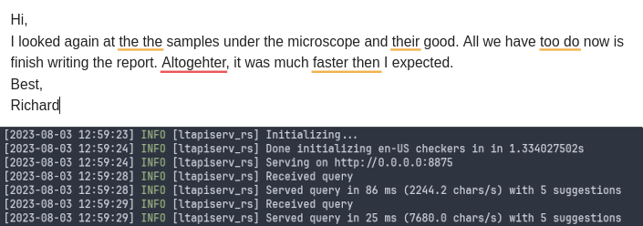
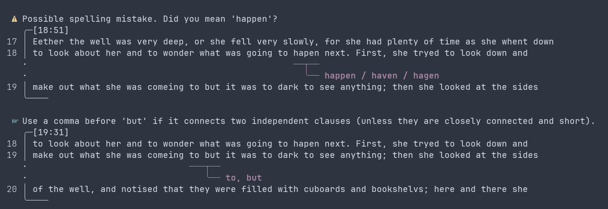
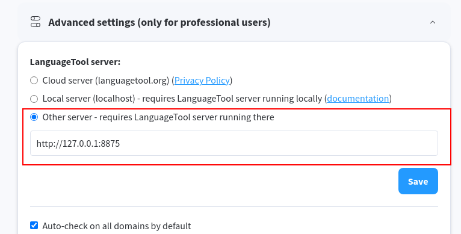
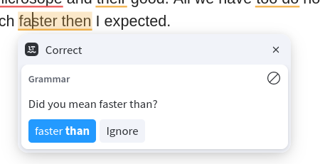

# ltapiserv-rs

This provides a **lightweight alternative backend implementation** of the LanguageTool API for **offline grammar and spell checking**, based on:

- [nlprule](https://github.com/bminixhofer/nlprule) for grammar and style checking, using the [LanguageTool rules](https://github.com/languagetool-org/languagetool).
- [symspell](https://github.com/reneklacan/symspell) for spell-checking.

## Quick start

1. [Install the server](#installation), which is a single binary with no dependencies, which can be run as a systemd service. Debian/Ubuntu and Arch packages are provided. Alternatively, a Docker image is available.
2. [Configure your client](#usage-clients) to use the local server.

## Screenshots

 \
_Using the `ltapiserv-rs` server with the official LanguageTool browser extension._

A simple command-line client is also provided, displaying results graphically with [ariadne](https://docs.rs/ariadne/latest/ariadne/index.html):



## Background

## LanguageTool

[LanguageTool](https://languagetool.org/) is an open-source alternative to [Grammarly](https://www.grammarly.com/) for natural language linting (spelling, grammar, style), with a [large set of rules](https://community.languagetool.org/). Multiple clients exist for its API, bringing functionalities to [Firefox](https://addons.mozilla.org/firefox/addon/languagetool/), [Chrome](https://chrome.google.com/webstore/detail/grammar-and-spell-checker/oldceeleldhonbafppcapldpdifcinji?utm_source=lt-homepage&utm_medium=referral), [LibreOffice](https://languagetool.org/libre-office), [Thunderbird](https://languagetool.org/thunderbird), [emacs](https://github.com/emacs-languagetool/flycheck-languagetool), and many more.

### Self-hosting LanguageTool

While most users access LanguageTool through the official hosted server (with a free or paid plan), the Java API server can be [hosted locally](https://dev.languagetool.org/http-server), which can be particularly desirable for privacy reasons (e.g. when editing confidential documents).

Even though the browser extensions are unfortunately [closed-source](https://forum.languagetool.org/t/license-and-source-code-for-firefox-add-on/3851), they still allow custom servers to be specified.

### Lightweight LanguageTool API server

[Benjamin Minixhofer](https://bmin.ai/) wrote a Rust crate, [`nlprule`](https://github.com/bminixhofer/nlprule), that is able to parse and then apply LanguageTool rules noticeably faster than the original Java implementation (see [this benchmark](https://github.com/bminixhofer/nlprule)). More complex rules written in Java are not supported and spellchecking is not implemented, but nevertheless roughly 85% of the LanguageTool grammar rules (as of 2021) are available.

Using `nlprule` and [`symspell`](https://crates.io/crates/symspell) (for spell-checking), we can implement a simple LanguageTool API server in Rust that can then be called from a variety of contexts using LanguageTool clients.

The code and binaries can be found on <i class="bi bi-github"></i> <https://github.com/cpg314/ltapiserv-rs>.  
See the `README` there for the configuration as a `systemd` service as well as the setup of the clients.

### Comparison with the Java server

Running [H.G. Wells' War of the Worlds](https://en.wikipedia.org/wiki/The_War_of_the_Worlds) (~6k lines and 62k words) through the two servers, using [hyperfine](https://github.com/sharkdp/hyperfine) and [httpie](https://httpie.io/docs/cli), we get:

```console
$ docker pull erikvl87/languagetool
$ docker run --rm -p 8010:8010 erikvl87/languagetool
  http://localhost:{port}/v2/check language=en-us text=@wells.txt'
$ for port in 8875 8010; do http --form  POST http://localhost:$port/v2/check \
                            language=en-us text=@wells.txt | jq ".matches|length"; done
1490
1045
$ hyperfine -L port 8875,8010 --runs 10 'http --ignore-stdin --meta --form  POST \
                   http://localhost:{port}/v2/check language=en-us text=@wells.txt'
```

The additional false positives in `ltapiserv-rs` seem to come mostly from the spell-checking.

| Command        |       Mean [s] | Min [s] | Max [s] |    Relative |
| :------------- | -------------: | ------: | ------: | ----------: |
| `ltapiserv-rs` | 16.002 ± 0.629 |  15.566 |  17.745 |        1.00 |
| `java`         | 30.594 ± 2.372 |  29.569 |  37.296 | 1.91 ± 0.17 |

With only a paragraph (to simulate something close to the normal use of LanguageTool, say in emails):

| Command        |   Mean [ms] | Min [ms] | Max [ms] | Relative |
| :------------- | ----------: | -------: | -------: | -------: |
| `ltapiserv-rs` | 379.7 ± 9.3 |    362.6 |    393.4 |     1.00 |

## Installation

Any of the following methods will make a server available at http://localhost:8875

By default, the custom dictionary is located in `~/.local/share/ltapiserv-rs/dictionary.txt`. A different path can be passed via the `--dictionary` option.

### Docker

```console
$ docker run -d --name ltapiserv-rs -p 8875:8875 -v ~/.local/share/ltapiserv-rs:/data ghcr.io/cpg314/ltapiserv-rs:0.2.2
$ docker logs -f ltapiserv-rs
```

### Debian/Ubuntu and Arch packages

Packages are available from the [releases page](https://github.com/cpg314/ltapiserv-rs/releases), containing the server and `ltapi-client`. They will install a `systemd` service definition in `/usr/lib/systemd/user/ltapiserv-rs.service`, which can be enabled with:

```console
$ systemctl --user enable --now ltapiserv-rs
$ # Check status
$ systemctl --user status ltapiserv-rs
$ # Check logs
$ journalctl --user -u ltapiserv-rs -f
```

### tar.gz archive

For other distributions, standalone binaries are also available from the [releases page](https://github.com/cpg314/ltapiserv-rs/releases).

```console
$ sudo cp ltapiserv-rs /usr/local/bin
$ sudo chmod +x /usr/local/bin/ltapiserv-rs
$ ln -s $(pwd)/ltapiserv-rs.service ~/.config/systemd/user/ltapiserv-rs.service
$ systemctl --user daemon-reload && systemctl --user enable --now ltapiserv-rs
$ systemctl --user status ltapiserv-rs
```

See the above remark about the custom dictionary.

## Usage / clients

The following clients have been tested. The server should be compatible with others, but there might be idiosyncrasies; don't hesitate to send a PR.

### Browser extension

Install the official LanguageTool browser extension (e.g. for [Chrome](https://languagetool.org/chrome) or [Firefox](https://languagetool.org/firefox)) and configure it to use your local server:



### Command line client

A command line client, `ltapi-client`, is also included in this project.

```console
$ cat text.txt | ltapi-client --server http://localhost:8875
$ ltapi-client --server http://localhost:8875 test.txt
```

The return code will be `1` if any error is detected. The server address can be configured through the `LTAPI_SERVER` environment variable.

Formats like Markdown, HTML, LaTeX etc. can be processed through `pandoc`:

```console
$ pandoc README.md -t plain | ltapi-client
```

The client uses [ariadne](https://docs.rs/ariadne/latest/ariadne/index.html) to get a nice graphical reporting of the errors:


### flycheck-languagetool (emacs)

See <https://github.com/emacs-languagetool/flycheck-languagetool>

```emacs-lisp
(use-package flycheck-languagetool
  :ensure t
  :hook ((text-mode gfm-mode markdown-mode) . flycheck-languagetool-setup)
  :init
  (setq flycheck-languagetool-url "http://127.0.0.1:8875")
  :custom
  (flycheck-languagetool-active-modes '(text-mode gfm-mode markdown-mode))
  )
```

### ltex-ls (language server protocol for markup)

See <https://github.com/valentjn/ltex-ls>.

This currently requires [this patch](https://github.com/valentjn/ltex-ls/pull/276) to send the proper content type in the requests (this also could be done in `ltapiserv-rs` with an axum middleware to edit the content type).

Use the `ltex.languageToolHttpServerUri` variable to set the URL, e.g. with [lsp-ltex](https://github.com/emacs-languagetool/lsp-ltex) in emacs:

```emacs-lisp
(use-package lsp-ltex
  :ensure t
  :hook (text-mode . (lambda ()
                       (require 'lsp-ltex)
                       (lsp)))  ; or lsp-deferred
  :init
  (setq lsp-ltex-version "16.0.0"
        lsp-ltex-languagetool-http-server-uri "http://localhost:8875"
        )
)
```

## Implementation details

### API endpoint

The LanguageTool API is documented [here](https://languagetool.org/http-api/swagger-ui/#!/default/post_check). It suffices to implement the HTTP POST `/v2/check` endpoint that processes

```rust
pub struct Request {
    text: Option<String>,
    data: Option<String>,
    language: String,
}
```

and returns

```rust
pub struct Response {
    pub matches: Vec<Match>,
    pub language: LanguageResponse,
}
pub struct Match {
    pub message: String,
    pub short_message: String,
    pub offset: usize,
    pub length: usize,
    pub replacements: Vec<Replacement>,
    pub sentence: String,
    pub context_for_sure_match: usize,
    pub ignore_for_incomplete_sentence: bool,
    pub r#type: MatchType,
    pub rule: Rule,
}

```

The most important fields in `Response` are `offset`, `length` (defining the span of the suggestion), `message`, `replacements`, and `Rule`.

There are a couple of small tricks required to get the closed-source browser extensions to behave as expected, e.g. in displaying grammar and spelling errors with the right colours and showing tooltips.




### Grammar, spelling, and repetition checkers

The main functionality, returning suggestions based on an input text, can be reduced to the following method:

```rust
pub fn suggest(&self, text: &str) -> Vec<api::Match> {
    let mut suggestions = Vec::new();
    for sentence in self.tokenizer.pipe(text) {
        debug!("Processing sentence {:#?}", sentence);
        // Grammar suggestions from nlprule
        suggestions
            .extend(self.rules.apply(&sentence).into_iter().map(Match::from));
        // Spelling and repetitions, processing the sentence token by token.
        let tokens = sentence.tokens();
        for (i, token) in tokens.iter().enumerate() {
            // ...
        }
    }
    suggestions
}
```

The `Match::from` method performs conversion between an [`nlprule::Suggestion`](https://docs.rs/nlprule/0.6.4/nlprule/types/struct.Suggestion.html) to a `Match`, essentially copying over the span and the message.

The `nlprule` crate does not yet support [spell checking](https://github.com/bminixhofer/nlprule/issues/2), but we can add a basic version using the [`symspell`](https://crates.io/crates/symspell) crate and leveraging the tokenization we already have from `nlprule`. Similarly, the tokenization allows us to implement a word repetition rule that did not seem present in `nlprule`.

## Compile from source

Binaries can also be built from source as follows:

```console
$ cargo make build
```

## Future work

- LanguageTool (even the original implementation with all rules) seems to be failing to identify more subtle grammatical errors:

  > "No one would have believed in the last years of the nineteenth century that this world were being watched keenly and closely by intelligences greater than man's"

  > "With infinite complacency men went to and fro over this globe about his little affairs, serene in their assurance of their empire over matter."

  It would be interesting to understand what the state of the art is (under a fast processing constraint).

- Support more languages. German is already supported in `nlprule`, but adding more languages is actually non-trivial because of language-specific assumptions, see [this issue](https://github.com/bminixhofer/nlprule/issues/46) and [this one](https://github.com/bminixhofer/nlprule/issues/14).
- Support addition and deletion of words to the dictionary. This is pretty simple and corresponds to the `/words/add` and `/words/delete` API endpoints.  
   Currently, the server allows passing the path to a custom dictionary at startup.
- Reduce the number of false positives of the spellchecker.
- Add unit and integration tests
