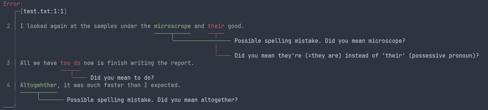

# ltapiserv-rs

Server implementation of the LanguageTool API for **offline grammar and spell checking**, based on:

- https://github.com/bminixhofer/nlprule for grammar and style checking, using the [LanguageTool rules](https://github.com/languagetool-org/languagetool).
- https://github.com/reneklacan/symspell for spell-checking

This also contains a simple command-line client, displaying results graphically with [ariadne](https://docs.rs/ariadne/latest/ariadne/index.html).

See <https://c.pgdm.ch/eps-projects/ltapiserv-rs>

## Installation

The recommended method is to get a binary from the release page and install it as a systemd service:

```console
$ sudo cp ltapiserv-rs /usr/local/bin
$ sudo chmod +x /usr/local/bin/ltapiserv-rs
$ ln -s $(pwd)/ltapiserv-rs.service ~/.config/systemd/user/ltapiserv-rs.service
$ systemctl --user daemon-reload && systemctl --user enable --now ltapiserv-rs
$ systemctl --user status ltapiserv-rs
```

A path to a custom dictionary can be passed to the server via the `--dictionary` option.

Alternatively, binaries can be built from source as follows:

```console
$ # Create en_US.tar.gz data archive (will be embedded in the binary).
$ bash create_archive.sh
$ cargo build --release
```

## Usage

### Browser extension

Install the offical LanguageTool browser extension (e.g. for [Chrome](https://languagetool.org/chrome) or [Firefox](https://languagetool.org/firefox)) and configure it to use your local server:


### Command line client

A command line client, `ltapi-client`, is also included in this codebase.

```console
$ cat text.txt | ltapi-client --server http://localhost:8875
$ ltapi-client --server http://localhost:8875 test.txt
```



The return code will be `1` if any error is detected.

### Flycheck (emacs)

```emacs-lisp
(use-package flycheck-languagetool
  :ensure t
  :hook (text-mode . flycheck-languagetool-setup)
  :init
  (setq flycheck-languagetool-url "http://127.0.0.1:8875")
)
```
